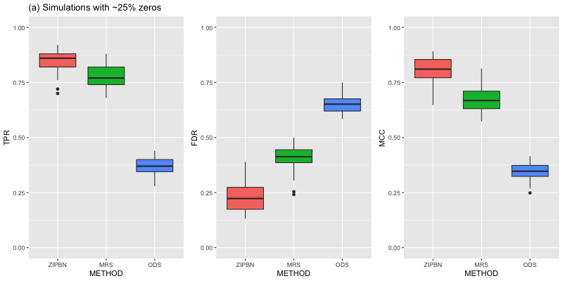
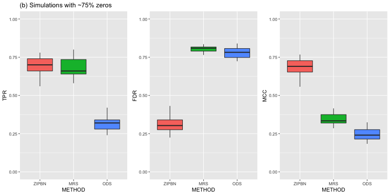

# Bayesian Causal Structural Learning with Zero-Inflated Poisson Bayesian Networks

This repository contains the implementation of a zero-inflated Poisson Bayesian network (ZIPBN) proposed by "Bayesian Causal Structural Learning with Zero-Inflated Poisson Bayesian Networks" by Junsouk Choi, Robert Chapkin, and Yang Ni. Specifically, our code in this repository will reproduce the simulation results corresponding to Table 2 in the paper. We hope that the provided code is helpful to give a detailed description of the procedure we did. 

## Requirements

Our implemenation requires some dependencies. Please run the following codes to the dependencies:

``` r
pkgs <- c("igraph", "pscl", "glmnet", "MXM", "foreach", "doParallel", "doRNG")
sapply(pkgs, install.packages, character.only = TRUE)
```

## Training

The `training` subdirectory contains training scripts that are used to perform simulations under different percentages of zeros in the paper (see Table 2).

* `ZIPBNfunctions.R` includes functions needed to implement the parallel-tempered Markov chain Monte Carlo (MCMC) algorithm for ZIPBN that is described in the paper.
* `zipbn_zero25pct.R` and `zipbn_zero75pct.R` implement our parallel-tempered MCMC algorithm and run  it on simulations with ~25% and ~75% zeros, respectively.
* `ods_zero25pct.R` and `ods_zero75pct.R` implement ODS algorithm of [Park &  Raskutti, 2015](https://papers.nips.cc/paper/5896-learning-large-scale-poisson-dag-models-based-on-overdispersion-scoring.pdf) and run it on simulations with ~25% and ~75% zeros, respectively.
* `mrs_zero25pct.R` and `mrs_zero75pct.R` implement MRS algorithm of [Park & Park, 2019](http://proceedings.mlr.press/v89/park19a/park19a.pdf) and run it on simulations with ~25% and ~75% zeros, respectively.

## Pre-trained Models

The `pre-trained` subdirectory stores simulation results which can be obtained by running our code in the `training/` subdirectory. These results are saved in .RData file format.

## Evaluation

In the `evaluation/` subdirectory, `eval_zero25pct.R` and `eval_zero75pct.R` evaluate ZIPBN by calculating the operating characteristics (TPR, FDR, and MCC) for simulations with different percentages of zeros (~25% vs. ~75%). 
They produce boxplots of the calculated operating characteristics, which are equivalent to the results in Table 2.
You can run `eval_zero25pct.R` and `eval_zero75pct.R` with the pre-trained models on simulations (`pre-trained/`), with appropriate specification of filepaths. 

## Results

The operating characteristics over 30 simulations for zero-inflated scenarios having ~25% and ~75% zeros are summarized in the boxplots below. Table 2 in the paper and the boxplots below are indeed based on the same results.

<p align="center">


</p>

Observe that ZIPBN clearly outperforms ODS and MRS in both cases. As the percentage of zeros increased from (a) ~25% to (b) ~75% , the overall performance of ZIPBN did not deteriorate much while FDR of MRS was doubled.
